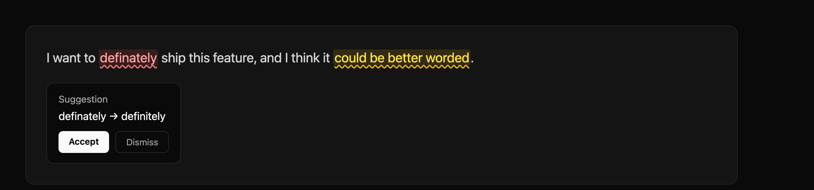

# Perfext — make perfect texts

Perfext is a Grammarly-style browser extension that suggests improvements to
your writing as you type, powered by **your own** AI model and API key, plus a
landing page to install it.



- **Red** highlight — likely wrong (typos, grammar, doesn't read well).
- **Yellow** highlight — understandable but could be better.
- **No highlight** — all good.

Hover a highlight to see the suggestion in a popover and **Accept** or
**Dismiss** it. Dismissed suggestions turn gray and can be restored.

## Repository layout

```
perfext/
├── apps/
│   ├── extension/      # Browser extension (WXT + React popup, MV3)
│   └── landing-page/   # Marketing site (Next.js, dark theme)
├── specs/              # Product specs + DECISIONS.md
├── turbo.json          # Turborepo pipeline
└── pnpm-workspace.yaml
```

How it works: the extension's **content script** watches the text fields you
type in, waits for you to pause (5s by default), and asks the **background
worker** to analyze the text. The background worker calls the AI provider you
configured (OpenAI or Anthropic) **directly** with your key — no Perfext server
is involved, so your text never leaves your browser except to your chosen
model. There is **no backend** in this MVP.

## Prerequisites

- **Node 22** (an `.nvmrc` is included) — the repo's system Node may be older.
- **pnpm 9** via Corepack.
- A **Chrome / Chromium / Edge** browser to load the extension.
- An **OpenAI** or **Anthropic** API key (you paste it into the extension).

```bash
nvm use            # picks up .nvmrc (Node 22)
corepack enable    # makes the pnpm in package.json available
pnpm install       # installs all workspaces
```

## Run everything (dev)

From the repo root:

```bash
pnpm dev           # runs landing page + extension dev servers via Turborepo
```

Ports: the **landing page** serves on `http://localhost:3000` and the
**extension** dev server runs on `3001`, so both can run at once.

Or run each app on its own (recommended while developing the extension, so you
can watch its logs):

### Landing page

```bash
pnpm --filter @perfext/landing-page dev
# open http://localhost:3000
```

### Browser extension

```bash
pnpm --filter @perfext/extension dev
```

WXT builds the extension to `apps/extension/.output/chrome-mv3/` and rebuilds on
change. To load it:

1. Open `chrome://extensions`.
2. Enable **Developer mode** (top-right).
3. Click **Load unpacked** and select
   `apps/extension/.output/chrome-mv3`.

> `pnpm dev` for the extension can also auto-open a browser with the extension
> installed. If it doesn't on your machine, use the **Load unpacked** steps
> above against the `.output/chrome-mv3` folder.

### Configure the extension

1. Click the **Perfext** icon in the toolbar to open the settings popup.
2. Choose a **provider** (OpenAI or Anthropic) and a **model**.
3. Paste your **API key** (stored locally in `chrome.storage`, never uploaded).
4. Optionally adjust the **wait before checking** slider, then **Save**.

### Try it

Go to any page with a `<textarea>` or text `<input>` (a GitHub comment box,
Reddit, a contact form…), type a sentence with a mistake (e.g.
"I definately think this is grate"), and wait a few seconds. Misspellings get a
red wavy underline; hover to accept the fix.

> **Scope note:** the MVP highlights `<textarea>` and text `<input>` fields.
> Rich `contenteditable` editors (Gmail body, X/Twitter, Notion, Google Docs)
> are not handled yet — see `specs/DECISIONS.md`.

## Build (production)

```bash
pnpm build         # builds both apps via Turborepo
```

- Landing page output: `apps/landing-page/.next/` (run `pnpm --filter
  @perfext/landing-page start` to serve it).
- Extension output: `apps/extension/.output/chrome-mv3/`.

Package the extension into a distributable zip **and** publish it to the
landing page's "Download latest" button in one step:

```bash
pnpm package:extension
# builds apps/extension/.output/*.zip and copies it to
# apps/landing-page/public/perfext-extension.zip
```

The landing page's "Download latest" button serves that file directly
(`/perfext-extension.zip`). After downloading, unzip it and load the unpacked
folder via `chrome://extensions` → **Load unpacked** (the zip is unpacked for
local installs; the Chrome Web Store accepts the zip as-is once published).

> **Deploying (Vercel etc.):** `apps/landing-page/public/perfext-extension.zip`
> is **committed to the repo** so static hosts serve it without running any
> extension build. After changing the extension, run `pnpm package:extension`
> and commit the refreshed zip, then redeploy.

To only build the zip without copying it:

```bash
pnpm --filter @perfext/extension zip   # -> apps/extension/.output/*.zip
```

## Useful scripts

| Command | What it does |
| --- | --- |
| `pnpm dev` | Run all apps in watch mode |
| `pnpm build` | Build all apps |
| `pnpm typecheck` | Type-check all apps |
| `pnpm clean` | Remove build artifacts |
| `pnpm --filter @perfext/extension dev:firefox` | Run the extension for Firefox |

## Troubleshooting

- **"No API key set" in the console / no suggestions:** open the popup and save
  a valid key for the selected provider.
- **OpenAI/Anthropic 401 or 429:** the key is invalid or rate-limited — both
  errors are logged to the page console prefixed with `[Perfext]`.
- **Highlights look slightly misaligned:** known limitation of the overlay
  technique on fields with unusual CSS; it self-corrects on scroll/resize.
- **Node errors during install/build:** make sure you're on Node 22
  (`nvm use`), not an older system Node.
